# Context View: Customer Onboarding Modernization

## Purpose

Show the primary business actor, the onboarding solution boundary, the governed
activation service, and the downstream policy administration dependency.

## Notation

This is a lightweight `C4-style` context and container view rendered as
Markdown with Mermaid.

```mermaid
flowchart LR
    A[Head of Customer Operations]
    B[Customer Onboarding Portal]
    C[Customer Onboarding Service]
    D[(Customer Activation Profile)]
    E[[Customer Activation Event Feed]]
    F[Integration Event Runtime]
    G[Policy Administration]

    A -->|sponsors and reviews outcomes| B
    B -->|approves onboarding| C
    C -->|creates or updates| D
    C -->|publishes| E
    E -->|hosted on| F
    F -->|delivers event| G
    G -->|consumes activation update| D
```

## Related Artifacts

- `STK-1001`
- `SOL-1001`
- `APP-1001`
- `APP-1002`
- `AS-1001`
- `IF-1001`
- `DO-1001`
