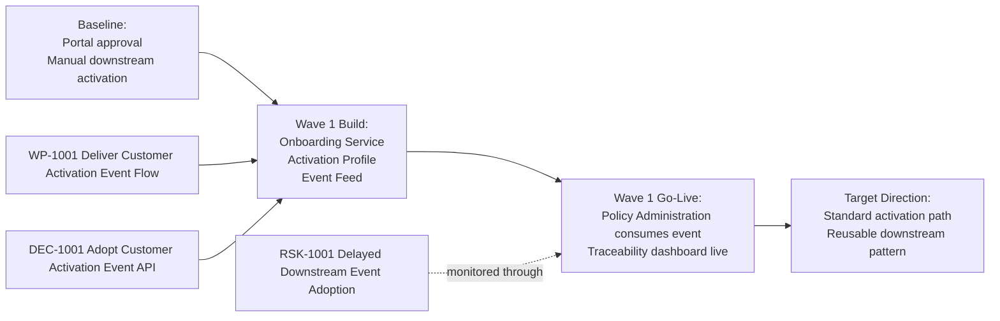

# Transition View: Customer Onboarding Wave 1

## Purpose

Show the phased move from manual downstream activation to the governed
activation service and event-driven Wave 1 target state.

## Notation

This is a custom transition view represented with Mermaid because the main
question is phased change rather than formal UML behavior.

## Related Artifacts

- `TA-1001`
- `WP-1001`
- `DEC-1001`
- `RSK-1001`
