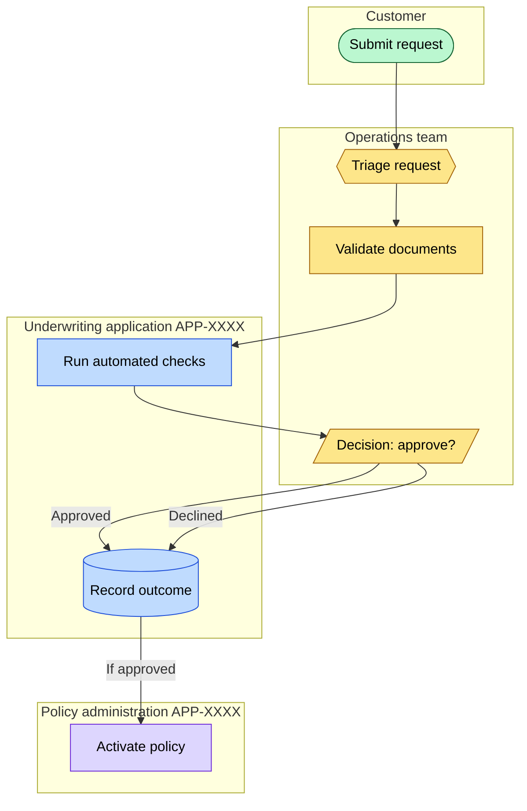

# Business Process View: <Subject>

**Question:** *What does this business process look like — who does what, in what order, with which handoffs and control points?*

**Audience:** *<business architects, sponsors, process owners>*

**Notation:** Mermaid flowchart with `subgraph` swimlanes. BPMN-ish but lighter — use a real BPMN tool for controlled process governance; this view is for architecture-level communication.

## Related Artifacts

- `BP-XXXX` — business process being modeled
- `BC-XXXX` — business capability or capabilities this process realizes
- `ORG-XXXX` — each swimlane / organization
- `APP-XXXX` — applications shown as lanes
- `STK-XXXX` — primary actors

## Tailoring

- Each `subgraph LANE_*` is one swimlane (role, team, system, or organization).
- Shape conventions used above: rounded `([...])` for start/external trigger, diamond `{{...}}` for decisions or gateways, square `[...]` for activities, slashed `[/.../]` for inline decision points, cylinder `[(...)]` for data/record outcomes.
- For controlled / regulated process modeling (e.g. for an audit deliverable), produce a real BPMN file alongside this view — Mermaid flowcharts don't carry BPMN semantics.
- Don't model every alternate path; show the happy path plus the most consequential failure path.
