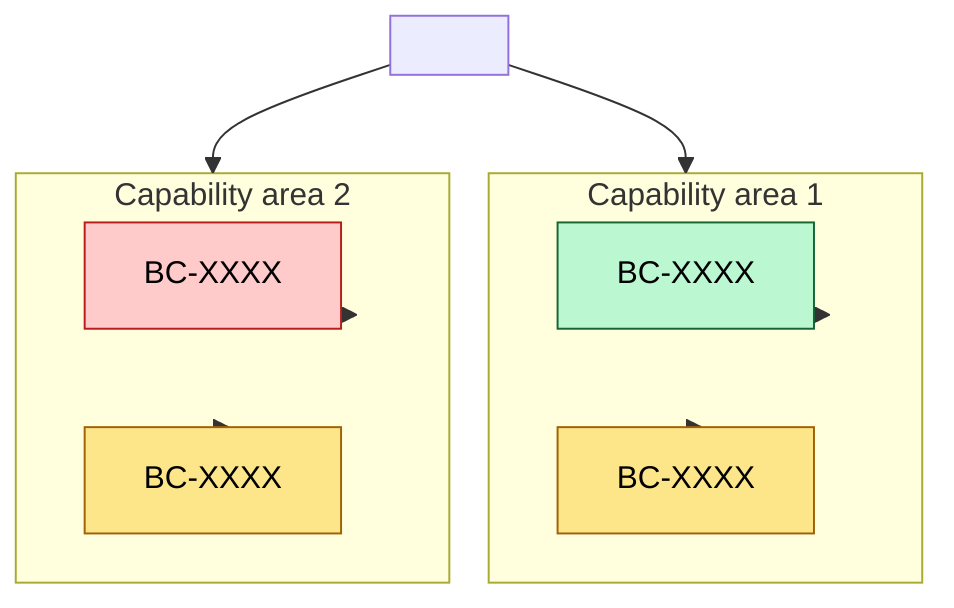

# Capability Heatmap: <Subject>

**Question:** *Where are our business capabilities strong vs weak, and where should we invest next?*

**Audience:** *<enterprise architects, business architects, CIO, investment committee>*

**Notation:** Mermaid for the structural map plus a Markdown table for the scoring detail. The flowchart shows hierarchy; the table carries the heatmap data.

## Capability Map

## Heatmap

| Capability | Maturity | Priority | Owner | Investment direction |
|---|---|---|---|---|
| `BC-XXXX` <Capability 1> | Strong | High | `ORG-XXXX` | Invest |
| `BC-XXXX` <Capability 2> | OK | Medium | `ORG-XXXX` | Tolerate |
| `BC-XXXX` <Capability 3> | Weak | High | `ORG-XXXX` | Migrate / replace |
| `BC-XXXX` <Capability 4> | OK | Low | `ORG-XXXX` | Eliminate |

**Investment direction values** (from [`patterns/business/application-invest-tolerate-migrate-eliminate.md`](../../patterns/business/application-invest-tolerate-migrate-eliminate.md)):

- **Invest** — grow / strengthen
- **Tolerate** — keep as-is for now
- **Migrate / replace** — modernize the underlying realization
- **Eliminate** — decommission

## Related Artifacts

- `BC-XXXX` — each business capability shown
- `ORG-XXXX` — owning organizations
- `OBJ-XXXX` — objectives the heatmap aligns to
- `DEC-XXXX` — decisions that drive the investment-direction choices
- `INI-XXXX` — initiatives realizing the priority items

## Tailoring

- For one-team / one-domain views, skip the L0 root and start from the capability area.
- Color rules above use green/amber/red for strong/ok/weak. If your team's house style differs, adjust the `classDef` values.
- For value-stream alignment (which capabilities each value-stream stage uses), pair with [`value-stream-view.md`](./value-stream-view.md).
- This view pairs well with the [`capability-based-planning`](../../playbooks/capability-based-planning/playbook.md) and [`portfolio-rationalization`](../../playbooks/portfolio-rationalization/playbook.md) playbooks.
