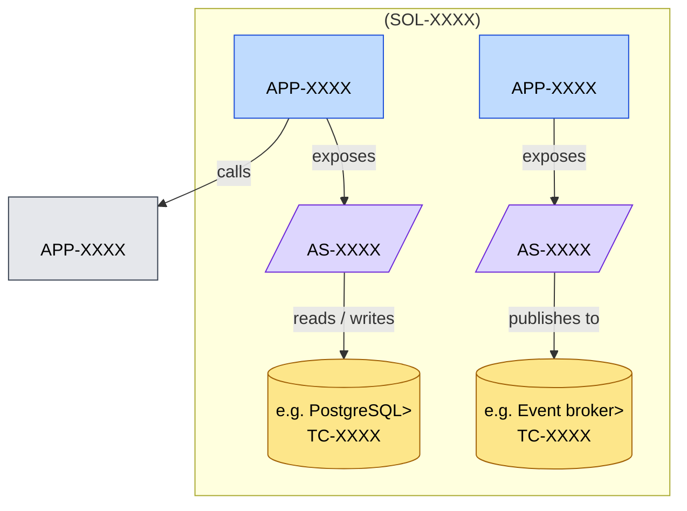

# Container View: <Subject>

**Question:** *Inside the system in scope, what are the deployable units, the services they expose, and the technology each runs on?*

**Audience:** *<e.g. delivery teams, solution review, integration architects>*

**Notation:** C4-style L2 container view in Mermaid. Use one box per application or runtime unit, with internal services and technology components nested or adjacent.

## Related Artifacts

- `SOL-XXXX` — solution providing the system boundary
- `APP-XXXX` — applications inside the system
- `AS-XXXX` — application-services
- `TC-XXXX` — technology components
- `IF-XXXX` — if interfaces are explicit, list them too
- `APP-XXXX` — external systems referenced

## Tailoring

- One level deeper than the context view; one level shallower than implementation.
- Don't draw individual classes or functions — that's code-level, not architecture.
- For runtime ordering of calls, switch to [`sequence-view.puml`](./sequence-view.puml).
- For environment / deployment, switch to [`deployment-view.puml`](./deployment-view.puml).
