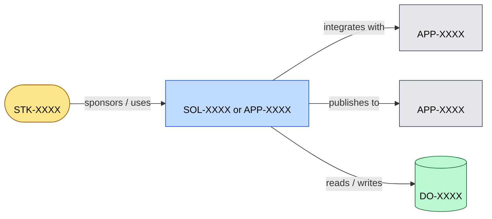

# Context View: <Subject>

**Question:** *What is the system in scope, who interacts with it, and what does it depend on?*

**Audience:** *<e.g. solution review board, sponsor, new joiner>*

**Notation:** C4-style L1 context view in Mermaid.

## Related Artifacts

- `STK-XXXX` — stakeholder
- `SOL-XXXX` or `APP-XXXX` — system in scope
- `APP-XXXX` — each external system
- `DO-XXXX` — relevant data objects

## Tailoring

- Add actors only if they're relevant to the question this view answers.
- Keep at one level of abstraction — for internal structure use [`container-view.md`](./container-view.md).
- Use double-parentheses `(())` for stakeholders, square brackets `[]` for systems, cylinder `[()]` for data.
- If your team uses C4 vocabulary explicitly, see [`../vocabulary-bridges/c4.md`](../vocabulary-bridges/c4.md) for the OA↔C4 mapping.
