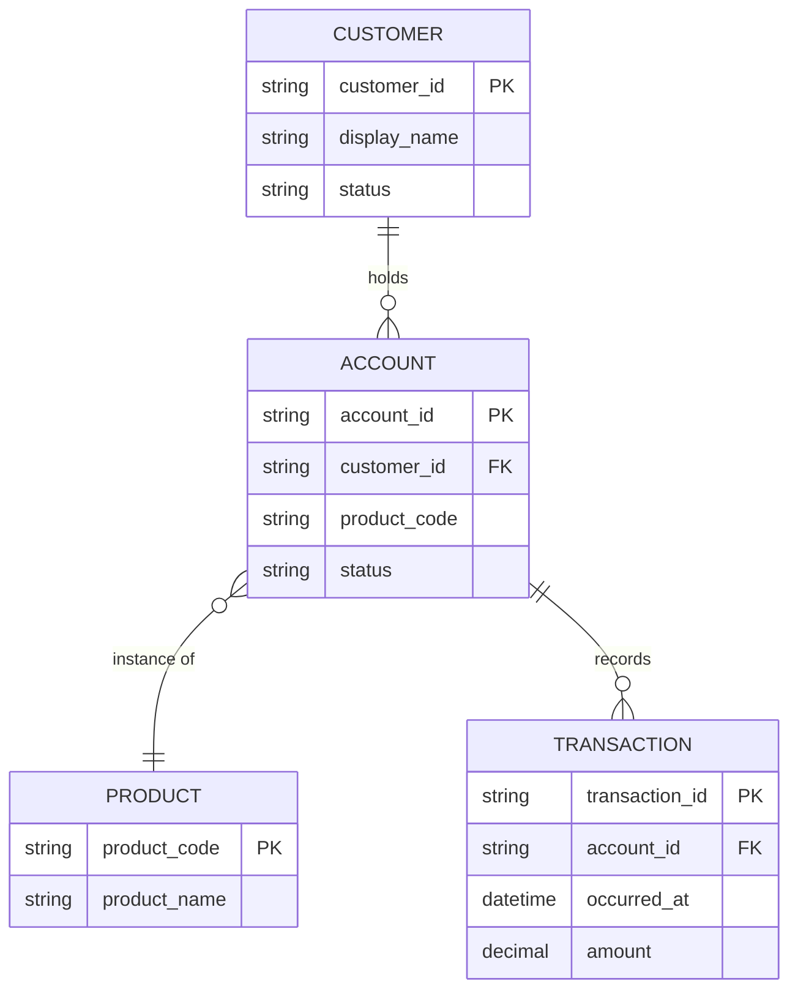

# Data Model: <Subject>

**Question:** *What are the architecturally significant data objects, what relates to what, and at what cardinality?*

**Audience:** *<data architects, integration architects, governance review>*

**Notation:** Mermaid `erDiagram`. Keep this at architecture-level — entities and relationships only; do not model every column unless a column carries an architectural constraint (residency, classification, key).

## Related Artifacts

- `DO-XXXX` — each entity above
- `APP-XXXX` — application(s) that own each data object as system of record
- `IF-XXXX` — interfaces that carry these objects across systems
- `DEC-XXXX` — any decision that governs ownership, residency, or classification

## Cardinality cheatsheet (Mermaid erDiagram)

| Syntax | Meaning |
|---|---|
| `\|\|--o{` | exactly one to zero-or-many |
| `\|\|--\|\|` | exactly one to exactly one |
| `}o--o{` | zero-or-many to zero-or-many |
| `\|o--o{` | zero-or-one to zero-or-many |

## Tailoring

- Show only architecturally significant attributes — primary key, foreign key, and any field that carries a governance / residency / classification implication.
- For per-record privacy or residency stance, annotate in the description or link to the relevant `compliance-assessment`.
- If the question is *how data moves between systems* rather than its shape, use a sequence or container view instead.
