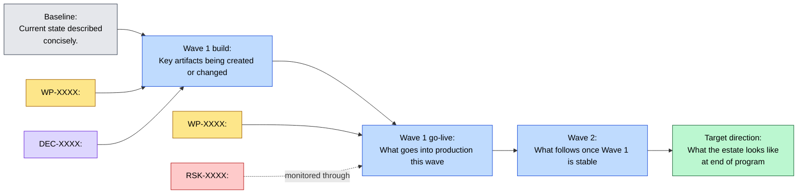

# Transition View: <Subject>

**Question:** *How does this transition move from baseline to target — what phases, what work packages, what dependencies, what risks?*

**Audience:** *<transformation sponsors, delivery PM, architecture review board>*

**Notation:** Mermaid flowchart. Custom transition view (not a UML form) because the question is phased change, not formal behavior.

## Related Artifacts

- `TA-XXXX` — the transition architecture this view illustrates
- `WP-XXXX` — each work package shown
- `DEC-XXXX` — decisions that gate or shape the transition
- `RSK-XXXX` — risks being monitored through the transition
- `INI-XXXX` — initiative this transition belongs to (if applicable)

## Tailoring

- Show baseline → target as the main spine; hang work packages, decisions, and risks off the relevant wave.
- Solid arrows for "delivers" or "enables"; dotted arrows (`-.text.->`) for "monitors", "constrains", "depends on indirectly".
- For roadmap-style views with calendar time, use a `gantt` chart instead.
- Keep wave labels short — phase names + 1-2 line context, not full descriptions.
