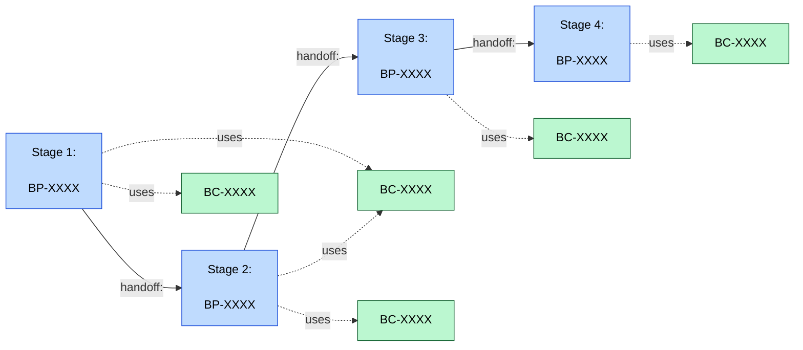

# Value Stream View: <Subject>

**Question:** *What are the stages of this value stream, which capabilities does each stage rely on, and where are the handoffs?*

**Audience:** *<business architects, sponsors, capability owners, process review>*

**Notation:** Mermaid flowchart. Value-stream stages run left-to-right; capabilities each stage uses are shown beneath the relevant stage; handoffs between stages are explicit.

## Related Artifacts

- `BP-XXXX` — each value-stream stage (modeled as a `business-process`)
- `BC-XXXX` — each capability the stages rely on
- `ORG-XXXX` — organizations that own each stage
- `APP-XXXX` — applications enabling each stage (if drawing application-aligned variant)
- `OBJ-XXXX` — objectives the stream contributes to

## Tailoring

- Solid arrows for stage transitions (the spine of the value stream); dotted arrows (`-.uses.->`) for capability dependencies (the supporting cast).
- Show the handoff content explicitly — what passes between stages is often where value leaks.
- For BIZBOK-style work, see the [`value-stream-to-capability-mapping`](../../patterns/business/value-stream-to-capability-mapping.md) pattern and the [BIZBOK bridge](../vocabulary-bridges/bizbok.md).
- For a heatmap of the supporting capabilities (which are strong vs weak), pair with [`capability-heatmap.md`](./capability-heatmap.md).
