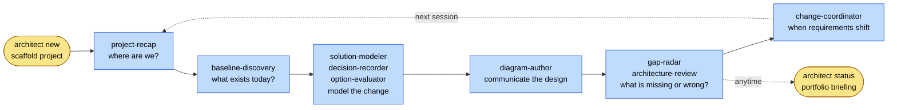

# Open Architect

Architecture work doesn't start clean. You join projects in flight, requirements are partial, the estate is undocumented, the standard you're held to keeps moving — and you still need to deliver something defensible.

**Open Architect** is an open-source, AI-aware workspace built for that reality. It pairs a structured architecture metamodel with active scanning skills, pre-packaged engagement playbooks, AI-era patterns, and an end-to-end workflow discipline — so the architect stays in control while AI catches what gets missed.

- **Architect-led.** AI assists; you decide.
- **Engagement-shaped.** Pick a playbook for the work you're actually doing, not a generic process.
- **Catches what you miss.** Scanning skills surface gaps an experienced reviewer would catch on a fresh read.
- **End-to-end workflow.** From re-entry to discovery to modeling to review to scope-change handling — one coherent loop, not a pile of tools.

---

## The architect's reality

Open Architect is built for the situations architects actually walk into:

- **You joined a project at month 18.** Three architects came before you. No one wrote down why.
- **You have unclear requirements** and stakeholders who change their mind weekly.
- **You're delivering to standards that didn't exist last year** — EU AI Act, DORA, NIS2, modern supply-chain integrity, zero-trust, observability-by-design.
- **You miss things under time pressure** — and reviewers find them at the worst moment.
- **Requirements shift mid-engagement** and you need a defensible audit trail of every scope change.
- **You work across multiple AI tools** (Claude, Codex, Copilot, others) and need them to behave consistently inside your workspace.

---

## How Open Architect works

Architecture work happens in a loop: orient yourself, find out what's there, model the change, check for gaps, handle scope shifts, brief the team — and pick up again next session. Open Architect names each step and remembers state between sessions so you're not starting fresh every time.



**A few files under each project carry the state forward across sessions:**

- A **working log** — the story of the project, in plain language, newest entry on top
- A **change register** — a running log of scope and requirement changes that sponsors can read directly
- Four **topical files** — open questions, confirmed answers, evidence requested, and an active task list

Skills read these when they start and suggest updates when they finish. When you re-enter a project, `project-recap` reads everything back and gives you the briefing.

---

## Signature capabilities

### Engagement playbooks

Pick the playbook that matches the work you're actually doing. Twenty-four shapes, each one a ready-to-go starting kit: which skills to run in what order, which review gates apply, the anti-patterns to avoid, the decisions you'll face, the questions to put on the backlog, the diagrams to draw, and a first-working-session script so you know how to spend day one.

| Family | Playbooks |
|---|---|
| Discovery & decision | `inventory-only`, `portfolio-rationalization`, `vendor-evaluation-and-selection`, `capability-based-planning` |
| Solution / design | `quick-solution-design` |
| Modernization & transition | `migration-wave`, `tech-debt-remediation`, `cloud-migration`, `domain-driven-redesign`, `decommissioning-program` |
| Platform bootstrap | `ai-platform-bootstrap`, `platform-engineering-bootstrap`, `enterprise-integration-bootstrap`, `data-platform-modernization` |
| Enterprise cycle | `full-togaf-adm` |
| Driver-specific | `compliance-driven-modernization`, `security-uplift`, `post-incident-architecture-review`, `business-continuity-readiness` |
| M&A lifecycle | `acquisition-due-diligence`, `post-acquisition-integration`, `divestiture-separation` |
| Practice setup & operation | `architecture-team-bootstrap`, `steady-state-governance` |

Pick one. Clone its config. Follow the brief. Per-playbook descriptions live in the [catalog](.architect/playbooks/README.md).

### Scanning skills

Three read-only scanners. None of them change your work — they just tell you what they see.

- **[`project-recap`](.architect/skills/project-recap.md)** — *"Where is this project right now?"* Reads everything in the project and gives you a briefing of what's confirmed, what's still open, what's gone stale, and what matters most. Run it first when you re-enter a project or join one mid-stream.
- **[`gap-radar`](.architect/skills/gap-radar.md)** — *"What am I missing?"* Catches the things an experienced reviewer would spot on a fresh read: blockers, missing required content, contradictions, invented owners, stale items, and modernity gaps (zero-trust, observability, AI Act, etc.). Each finding has a severity marker. Run it before a review gate.
- **[`capability-radar`](.architect/skills/capability-radar.md)** — *"Has the Open Architect library itself drifted?"* A scan for maintainers of OA itself rather than for project work. Most users won't need this; library maintainers run it before publishing changes.

### Workflow discipline

The things that quietly drift in real engagements — the project narrative, the scope changes, and where each project actually stands — get tracked explicitly.

- **Working log** — every meaningful step gets a short, plain-language entry. Someone joining the project can read the file and know what happened.
- **Change register** — when a requirement changes, OA records what changed, what it touches, and whether it warranted a formal decision. Sponsors get a one-page view of scope drift instead of having to chase it across artifacts. The [`change-coordinator`](.architect/skills/change-coordinator.md) skill runs the procedure; the [`requirement-change-handling`](.architect/guidance/requirement-change-handling.md) guide explains the rules.
- **`architect status` CLI** — one command shows you all your projects, what each one is working on, what's blocking it, and what's next. Useful for a Monday-morning catchup or a sponsor briefing.

### AI-era patterns

Eight patterns for the AI-shaped questions modern architects face — RAG, prompt and model lifecycle, continuous evaluation, guardrails, bounded agent loops, embeddings, and vendor portability. Each one covers when it applies, what it looks like, and what trades it forces. Used directly by the `ai-platform-bootstrap` playbook and by Gap Radar's AI Platform checks.

→ [`patterns/ai/`](.architect/patterns/ai/README.md)

### Diagrams as code

Nine starter diagrams covering the views architects actually draw — context, container, sequence, deployment, data model, business process, transition wave, capability heatmap, value stream. You don't start from a blank file; you copy the closest starter and fill in the real names. Diagrams stay in text (Mermaid for most, PlantUML where Mermaid is too thin) so they version, diff, and edit like any other file.

→ [`guidance/diagram-starter-views/`](.architect/guidance/diagram-starter-views/README.md) · [`diagram-author`](.architect/skills/diagram-author.md) skill

### Foundation

What everything else sits on:

- **A common shape for every architecture artifact.** Applications, interfaces, capabilities, decisions, transitions, requirements, risks, and 18 more — each one has a typed YAML template with the same fields for ownership, lifecycle, evidence, and relationships. That's what makes the workspace queryable instead of being a pile of documents. → [`templates/`](.architect/templates/) (25 kinds)
- **A reusable pattern library.** 100+ patterns across nine domains (business, application, integration, data, security, technology, transition, governance, AI). Each pattern says when to use it, when not to, and what tradeoffs you're accepting. Skills reach into the library as normal working context. → [`patterns/`](.architect/patterns/)
- **A skill library.** ~27 named procedures the architect can run — discovery, modeling, decisions, options, transitions, reviews, handovers, and the scanners above. Each skill has a clear "what it reads, what it produces, what good looks like." → [`skills/`](.architect/skills/)
- **A role library.** 11 architecture roles with explicit boundaries — perspective and accountability live in roles; what they actually do lives in skills. → [`roles/`](.architect/roles/)
- **Compliance scoping built in.** Pick the jurisdictions, sectors, and regulations that apply (GDPR, EU AI Act, DORA, NIS2, HIPAA, PCI DSS, FedRAMP, and many more) and the skills that need to know — will know. → [`compliance/`](.architect/compliance/)
- **Vocabulary bridges** for teams that already speak TOGAF, ArchiMate-Lite, C4, DDD, BIZBOK, or Cloud Well-Architected — the bridge tells you which Open Architect concept matches which one you already know. → [`guidance/vocabulary-bridges/`](.architect/guidance/vocabulary-bridges/)
- **Three validators** under [`validation/`](.architect/validation/) that check the workspace stays consistent — template shape, live artifacts, and the OA library itself.

---

## When to use it

| If you're... | Run / use |
|---|---|
| Joining a project mid-stream or returning after time away | `project-recap` |
| Preparing for a review gate or after a stretch of intensive modeling | `gap-radar` |
| Producing or refreshing a diagram | `diagram-author` + a [starter view](.architect/guidance/diagram-starter-views/README.md) |
| A requirement just changed | `change-coordinator` (writes to `change-register.md`) |
| Need a portfolio overview or single-project briefing | `architect status [project-name]` |
| Starting a new engagement | pick a playbook from the [catalog](.architect/playbooks/README.md) |
| Standing up AI capability inside an engagement | the [AI patterns](.architect/patterns/ai/README.md) |
| Using TOGAF / ArchiMate-Lite / C4 / DDD / BIZBOK / Cloud Well-Architected vocabulary | [`guidance/vocabulary-bridges/`](.architect/guidance/vocabulary-bridges/) |
| Worried the `.architect/` library has drifted | `capability-radar` (or `Validate-Capability.ps1` for the mechanical subset) |
| Not sure which playbook fits | `./architect.sh list-playbooks` then `./architect.sh playbook <name>` |

---

## What a session looks like

### A `gap-radar` pass before a review gate

```
Mode: Review · Role: Chief Architect · Confidence: High

## Blockers
🚫 sol-1002-payment-orchestration is marked `accepted` but related
   decisions D-0007 and D-0008 are still `proposed`
🚫 int-1003 carries PII but declares no encryption-in-transit stance

## Missing Required Content
- 3 applications without an accountable owner (app-1002, app-1004, app-1009)
- 2 transitions without rollback approach declared (ta-2002, ta-2003)

## Present-Day Standards Gaps
- sol-1002 has no observability ownership named (who reads the dashboards?)
- 4 services with credentials in scope have no secret rotation cadence
- No BCP/DR posture stated for the 2 critical solutions

## Bottom Line
The two blockers are fixable today. The 3-without-owner and missing
observability ownership are the real risks before the gate.

Your move: pick a finding to address, or ask for the full list.
```

### An `architect status` portfolio briefing

```
Open Architect 0.1.0 -- portfolio status

----------------------------------------------------------------------
internal-iam-consolidation  [migration-wave]

  Last activity: 2026-04-18 -- Decision recorded: federated identity
                               over single-IdP for Wave 1

  Biggest signal:
    Cutover risk concentrated in Wave 1 (directory merge step).
    Need rehearsal evidence before delivery teams commit to dates.

  🚫 Blockers (2):
    • 3 transitions declare no rollback approach (ta-2001, ta-2003,
      ta-2007)
    • Break-glass access procedure not defined for the new IdP

  Next 3 immediate tasks:
    1. Decide: Wave 1 rehearsal mix — table-top vs partial vs full
    2. Confirm: Service-account inventory completeness with IAM ops
    3. Request: Application-by-application authentication-protocol
       survey

  Totals: 11 open questions · 9 immediate · 4 evidence requests
----------------------------------------------------------------------
Total: 1 project(s)
```

These reports — scannable, severity-marked, pattern-referenced, oriented around the architect's next move — are the kind of output Open Architect produces.

---

## Getting Started

The fastest path is the `architect` CLI:

```bash
# PowerShell
./architect.ps1 new my-project -Playbook quick-solution-design
./architect.ps1 status              # portfolio view
./architect.ps1 status my-project   # deep view of one project

# Bash
./architect.sh new my-project --playbook quick-solution-design
./architect.sh status
./architect.sh status my-project
```

`architect new` scaffolds `workspace/my-project/` with `project-config.yaml`, `notes.md`, `architect-work/` (six standard files: open-questions, answers-and-confirmations, evidence-requests, architect-task-list, working-log, change-register), and `docs/` ready to use.

Then **follow the playbook's First Working Session steps** (in `.architect/playbooks/<playbook>/playbook.md`).

To see available playbooks: `./architect.sh list-playbooks` (or check the [catalog](.architect/playbooks/README.md)).

**Quick-start guides:**

- [Playbooks overview](.architect/playbooks/README.md) — pick an engagement shape
- [`architect` CLI](.architect/cli/README.md) — init, new, status, list-playbooks, playbook, list-projects
- [Starter project guide](.architect/config/starter-project.md) — minimum useful setup
- [Prompt recipes](.architect/config/prompt-recipes.md) — practical prompts for inventory, analysis, review, decision, and modeling
- [Cheat sheet](.architect/config/cheat-sheet.md) — fast reference
- [Diagram starter views](.architect/guidance/diagram-starter-views/README.md) — copy-from-here templates for the 9 most common view types

---

## What's in the repo

```text
architect.ps1 / architect.sh   ← CLI delegators (call from repo root)

.architect/            ← capability library (the tool)
  VERSION              ← capability version (semver, single source of truth)
  CHANGELOG.md         ← Keep-a-Changelog history
  cli/                 ← `architect` CLI source + templates
  playbooks/           ← engagement shapes — 24 across 8 families (start here)
  patterns/            ← reusable architecture patterns (incl. patterns/ai/)
  templates/           ← the metamodel — what each artifact kind looks like
  skills/              ← reusable procedures (delivery + scanning)
  roles/               ← role descriptions and accountabilities
  method/              ← chosen project method + ADM and transition references
  guidance/            ← conventions, glossary, vocabulary-bridges/, diagram-starter-views/,
                         capability-maintenance, requirement-change-handling
  compliance/          ← jurisdiction, sector, and control obligations
  examples/            ← worked reference projects
  agents/              ← runtime profiles for multi-agent execution (advanced)
  runtime/             ← live queue / gate state (advanced)
  schemas/             ← formal JSON Schema contracts (advanced)
  validation/          ← validators for templates, artifacts, and the capability library
  config/              ← workspace-defaults.yaml, response-display.md, agent.config.md

workspace/             ← where your project work lives (one folder per project, gitignored)
  <project-name>/
    project-config.yaml
    notes.md
    architect-work/    ← six standard files: open-questions, answers, evidence,
                         tasks, working-log, change-register
    docs/              ← source material
    views/             ← diagrams (Mermaid / PlantUML)
    business/  application/  data/  technology/  governance/  change/
```

Three levels:

- **Core** — everyday architect-assist use
- **Optional** — additional structure for more formal projects
- **Advanced** — multi-agent orchestration, schemas, runtime state

Detailed workspace docs: [.architect/README.md](.architect/README.md).

---

## How AI agents are guided

[`AGENTS.md`](AGENTS.md) in the repo root tells AI agents (Claude Code, Codex, others) how to respond inside this workspace. It defines the display contract, status labels, structured-choice convention, and behavioral guardrails — including ownership truthfulness rules to prevent agents from inventing facts to make artifacts look complete.

Edit it once for your team; any AI tool that respects the convention picks it up.

---

## Project status

Open Architect is at **capability v0.1.0** — a strong foundation stage with most of the value-producing workflow in place:

- ✅ Templates, patterns (incl. AI), compliance, playbooks, vocabulary bridges in place
- ✅ Scanning skills shipped: `project-recap`, `gap-radar`, `capability-radar`
- ✅ End-to-end workflow discipline: working log, change register, requirement-change handling
- ✅ Diagrams-as-code with 9 starter view templates
- ✅ CLI: `init`, `new`, `status`, `list-playbooks`, `list-projects`, `playbook`, `help`, `version`
- ✅ Three validators (templates, artifacts, capability library)
- ✅ Drift defense: `capability-maintenance.md` + `capability-radar` + `Validate-Capability.ps1`
- 🟡 Real-project proving in progress
- 🟡 Worked examples still thin — currently one (`customer-onboarding-modernization`)
- 🟡 Validators don't yet execute the Gap Radar checklists mechanically
- 🟡 Multi-agent runtime scaffold exists but unproven against a live engagement

See [`.architect/guidance/current-state.md`](.architect/guidance/current-state.md) for the maintainer-level snapshot, [`.architect/CHANGELOG.md`](.architect/CHANGELOG.md) for the release history.

---

## Contributing

Useful contribution areas (the list reflects current gaps):

- **Worked examples across industries** — only `customer-onboarding-modernization` exists today. AI platform, M&A, regulated finance, healthcare, public sector, and OT/IT manufacturing examples would each move adoption materially.
- **Tier 2 AI patterns** — inference caching, FinOps signals, tenant isolation, AI Act Article 50 disclosure, hallucination handling, red-teaming, human-in-the-loop review.
- **Additional vocabulary bridges** — Wardley Mapping, ISO/IEC/IEEE 42010, Zachman, or others. Current set: TOGAF, ArchiMate-Lite, C4, DDD, BIZBOK, Cloud Well-Architected.
- **Runnable gap-radar checks** — checklists today are guidance; mechanically executable validators for §1 (Completeness) and §2 (Consistency) would let the radar run in CI.
- **CI / GitHub Actions wiring** — three validators exist; running them on every PR would lock in drift defense for contributors.
- **Method tailoring guides** — TOGAF tailoring, DDD-aligned engagement, lean architecture, lightweight RACI.
- **New playbooks for engagement shapes not yet in the catalog** — current 24 cover discovery, solution/design, modernization, platform bootstrap, enterprise cycle, driver-specific, M&A, and practice setup. Gaps: hybrid/edge, OT/IT convergence, sustainability-driven architecture, AI red-team programs.
- **Executable agent payloads** — the `agents/` + `runtime/` scaffold exists structurally but no skill has been bound to an agent profile and run end-to-end against a real engagement.

Issues and pull requests welcome.

---

## License

Apache License 2.0. See [LICENSE](LICENSE).
